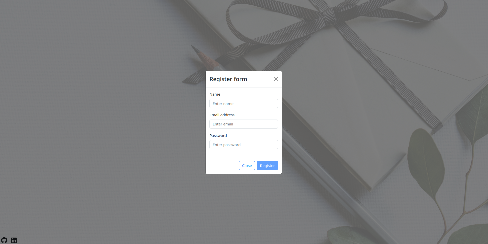
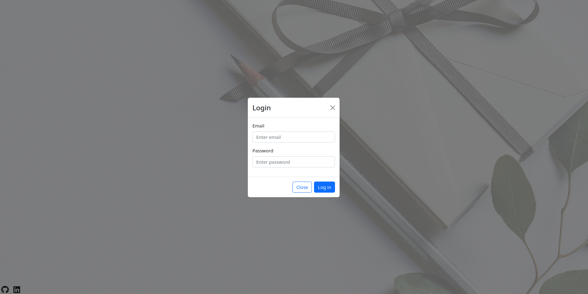
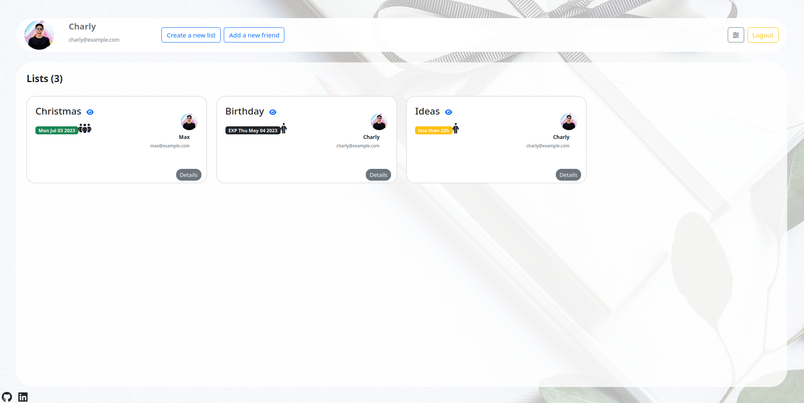
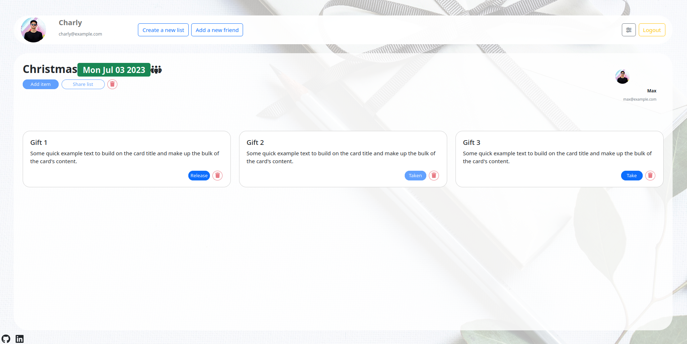
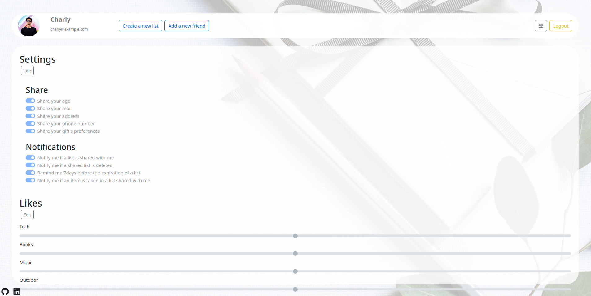

# [ In Development ] GILI, your own gift list application

A simple way to exchange your wish lists to friends :
- Create an account 
- Login
- Create lists
- Add items to your lists 
- Add friends
- And share your lists with them !

## The FARM Stack

* FastAPI
* React
* MongoDB

## Configure

Create your `.env` file in the root folder: 

```
MONGO_USER="yourusername"
MONGO_PWD="yourpassword"
MONGO_DATABASE="gili"
MONGO_PORT="yourmongoserverport"
MONGO_IP="yourmongoserverIP"
```

## Run
```
docker-compose up --build
```

Go to `localhost:3000`


## Screenshots








# TODOs
- [ ] Fill the README file
- [ ] Write comments, a lot !
- [ ] /!\ Do not push the all user settings... pwd included /!\
- [ ] Add try/catch everywehere to handle errors
- [ ] Make the design prettier (usercards) 
- [ ] Add a licence file
- [ ] Enable the user to modify the avatar
- [ ] Be able to stroe images
- [ ] Send mails to users
- [ ] Invite new users by mail
- [ ] Comment a wish (for more info)
- [ ] Add a price range
- [ ] Ask for the same wish multiple times
- [ ] Find out why ethe logout button got a 'max depth exceeded' error
